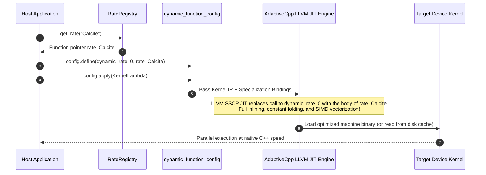

# AdaptiveCpp SSCP JIT Kinetics

## 1. Motivation: Dynamic Kinetics on Accelerators

In geochemical software such as PHREEQC, kinetic rate laws are traditionally expressed as interpreted BASIC scripts inside the thermodynamic database (e.g., `RATES -> Calcite`). Executing such rate scripts inside a massively parallel SYCL backend presents two common pitfalls:

1. **Interpreters on the GPU**: Evaluating an AST or bytecode inside vector threads triggers catastrophic branch divergence, high register pressure, and severe execution degradation.
2. **Classic Device Function Pointers**: Indirect function calls prevent compiler inlining, generate costly branch indirection, and are poorly supported or prohibited on several GPU targets.

**The Solution**: We utilize the **AdaptiveCpp SSCP (Single Source Multiple Endpoints) Dynamic Function Specialization Interface** (`sycl::AdaptiveCpp_jit::dynamic_function`). Precompiled C++ rate functions are dynamically bound at runtime into placeholder symbols and completely **inlined and optimized** by the LLVM JIT engine.

---

## 2. Dynamic Function Specialization Architecture



### 2.1 Generic RateContext Template (`include/rates.hpp`)

The rate law operates on a `geochem::RateContext<Real>` template object, allowing dynamic floating-point precision (e.g., `double` or `float`). The context provides highly optimized access to phase indices:

```cpp
template<typename Real>
class RateContext {
public:
    Real m() const;       // Current moles
    Real tk() const;      // Temperature in Kelvin
    Real parm(int i) const;
    Real si(const char* name) const;
    Real act(const char* name) const;
    // ...
};
```

---

## 3. The Basic-to-C++ Transpiler (`BasicTranspiler`)

Previously, PHREEQC required rate laws to be written as BASIC interpreted strings inside `phreeqc_kin.dat` (e.g. `10 moles = 0`, `20 if ... goto 200`). To eliminate interpretation overhead while retaining 100% database compatibility, we integrated a real-time `BasicTranspiler`.

When parsing the database, `BasicTranspiler` uses regex-based AST analysis to transpile the BASIC logic into C++ code:

### Source (BASIC in database)
```basic
10 moles=0
20 IF ((M<=0) and (SI("Calcite")<0)) then goto 200
90 mech_a = 10^logK25_a * e^(-Ea_a/R*deltaT) * act("H+")
200 save moles
```

### Transpiled (C++ SYCL)
```cpp
template<typename Real>
SYCL_EXTERNAL inline Real rate_Calcite(const geochem::RateContext<Real>& ctx) {
    Real M = 0.0, moles = 0.0, R = 0.0, mech_a = 0.0, rate = 0.0;
    L10: moles = 0;
    L20: if ((ctx.m()<=0) && (ctx.si("Calcite")<0)) { goto L200; }
    // ...
    L90: mech_a = sycl::pow(static_cast<Real>(10.0), static_cast<Real>(logK25_a)) * sycl::exp(static_cast<Real>(-Ea_a/R*deltaT)) * ctx.act("H+");
    // ...
    L200: return moles;
    return 0.0;
}
```

---

## 4. Kernel Specialization & Registration

The `JitCompiler` generates a unique kernel wrapper that links the transpired rate functions to the placeholder endpoints (`dynamic_rate_X`) via SSCP Reflection.

```cpp
// Auto-generated by JitCompiler
geochem::RateRegistry::instance().register_rate("Calcite", geochem::rate_Calcite<double>);
hipsycl::glue::reflection::enable_function_symbol_reflection(geochem::rate_Calcite<double>);
```

Prior to kernel submission, the solver backend binds the desired rate law to the placeholder:

```cpp
sycl::AdaptiveCpp_jit::dynamic_function_config config;
if (K > 0) {
    RateFnPtr fn0 = reg.get_rate(matrices_.kinetics_names[0]);
    config.define(dynamic_rate_0, fn0);
}

auto specialized_kernel = config.apply([=](sycl::id<1> item) {
    // LLVM SSCP JIT inlines rate_Calcite() directly into this body!
    RateContext<double> ctx(cell_moles, cell_m0, temp, dt, parms, act, si, sr, totals, kin_moles);
    double dm = dynamic_rate_0(ctx);
    // ...
});
```

---

## 5. Guide: Adding a New Kinetic Rate Law

Thanks to the `BasicTranspiler`, you **no longer need to write any C++ code**! 
To register a new rate law (e.g., Quartz dissolution):

1. **Add it directly to the database** (`database/phreeqc_kin.dat`):
   ```basic
   Quartz
   -start
   10 if (m <= 0 and si("Quartz") < 0) then goto 200
   20 k = 10^-13.99
   30 moles = parm(1) * k * (1 - sr("Quartz")) * time
   200 save moles
   -end
   ```

2. **Run the application**: As soon as `"Quartz"` is referenced in your `.pqi` input script, `geochem_sycl` will automatically parse the BASIC script, transpile it to C++, inject it into the solver backend, and JIT-compile a new optimized library on the GPU!
