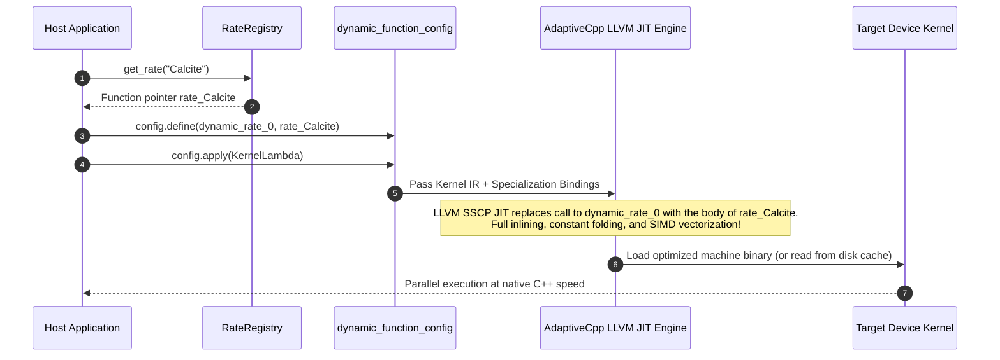

# AdaptiveCpp SSCP JIT Kinetics

## 1. Motivation: Dynamic Kinetics on Accelerators

In geochemical software such as PHREEQC, kinetic rate laws are traditionally expressed as interpreted BASIC scripts inside the thermodynamic database (e.g., `RATES -> Calcite`). Executing such rate scripts inside a massively parallel SYCL backend presents two common pitfalls:

1. **Interpreters on the GPU**: Evaluating an AST or bytecode inside vector threads triggers catastrophic branch divergence, high register pressure, and severe execution degradation.
2. **Classic Device Function Pointers**: Indirect function calls prevent compiler inlining, generate costly branch indirection, and are poorly supported or prohibited on several GPU targets.

**The Solution**: We utilize the **AdaptiveCpp SSCP (Single Source Multiple Endpoints) Dynamic Function Specialization Interface** (`sycl::AdaptiveCpp_jit::dynamic_function`). Precompiled C++ rate functions are dynamically bound at runtime into placeholder symbols and completely **inlined and optimized** by the LLVM JIT engine.

---

## 2. Dynamic Function Specialization Architecture



### 2.1 Dynamic Function Declarations ([`include/rates.hpp`](file:///mnt/nfsshare/home/mluebke/phreeqc3/cpp_sycl/include/rates.hpp))

For the AdaptiveCpp SSCP pass to resolve and inline functions at the device level, both the placeholder targets and the concrete rate functions must be declared with `SYCL_EXTERNAL inline` and made visible to the kernel translation unit:

```cpp
// Generic signature for all rate laws
using RateFnPtr = double (*)(
    double m, double m0, double tk, double time,
    const double* parms,
    const double* activities,
    const double* si,
    const double* sr,
    const int* indices
);

// Dynamic placeholder symbols (replaced by JIT compiler)
SYCL_EXTERNAL inline double dynamic_rate_0(double m, double m0, double tk, double time,
                                           const double* parms, const double* activities,
                                           const double* si, const double* sr, const int* indices) {
    return 0.0;
}

// Concrete rate law implementation for Calcite dissolution
SYCL_EXTERNAL inline double rate_Calcite(double m, double m0, double tk, double time,
                                         const double* parms, const double* activities,
                                         const double* si, const double* sr, const int* indices) {
    double M = m;
    double TK = tk;

    double act_H = activities[indices[0]];
    double si_Calcite = si[indices[1]];
    double sr_Calcite = sr[indices[1]];

    // Zero dissolution if mineral is exhausted under undersaturated conditions
    if (M <= 0.0 && si_Calcite < 0.0) return 0.0;

    constexpr double R = 8.314462;
    double deltaT = 1.0 / TK - 1.0 / 298.15;
    constexpr double e = 2.718282;

    // Mechanism 1 (acid region)
    constexpr double Ea_a = 14400.0;
    constexpr double logK25_a = -0.3;
    double mech_a = sycl::pow(10.0, logK25_a) * sycl::pow(e, -Ea_a / R * deltaT) * act_H;

    // Mechanism 2 (neutral / water region)
    constexpr double Ea_c = 23500.0;
    constexpr double logK25_c = -5.81;
    double mech_c = sycl::pow(10.0, logK25_c) * sycl::pow(e, -Ea_c / R * deltaT);

    double rate = mech_a + mech_c;
    double moles = parms[0] * rate * (1.0 - sr_Calcite);
    return moles * time;
}
```

---

## 3. Symbol Reflection & Registration ([`src/rates.cpp`](file:///mnt/nfsshare/home/mluebke/phreeqc3/cpp_sycl/src/rates.cpp))

AdaptiveCpp requires function pointers to be mapped to their mangled LLVM symbol names. This is registered during runtime initialization:

```cpp
void RateRegistry::register_reflection() {
    hipsycl::glue::reflection::enable_function_symbol_reflection(dynamic_rate_0);
    hipsycl::glue::reflection::enable_function_symbol_reflection(dynamic_rate_1);
    hipsycl::glue::reflection::enable_function_symbol_reflection(dynamic_rate_2);
    hipsycl::glue::reflection::enable_function_symbol_reflection(dynamic_rate_3);

    hipsycl::glue::reflection::enable_function_symbol_reflection(rate_dummy);
    hipsycl::glue::reflection::enable_function_symbol_reflection(rate_Calcite);
    hipsycl::glue::reflection::enable_function_symbol_reflection(rate_Dolomite);
}
```

### 3.1 Kernel Specialization at Launch Time ([`src/solver_backend.cpp`](file:///mnt/nfsshare/home/mluebke/phreeqc3/cpp_sycl/src/solver_backend.cpp))
Prior to kernel submission, the solver backend binds the desired rate law to the placeholder:
```cpp
sycl::AdaptiveCpp_jit::dynamic_function_config config;
if (K > 0) {
    RateFnPtr fn0 = reg.get_rate(matrices_.kinetics_names[0]);
    config.define(dynamic_rate_0, fn0);
}

auto specialized_kernel = config.apply([=](sycl::id<1> item) {
    // Inside the kernel, calling dynamic_rate_0() executes as a regular call.
    // The JIT compiler inlines rate_Calcite() directly into this body!
    double dm = dynamic_rate_0(cell_moles, cell_m0, temp, dt, parms, act, si, sr, indices);
    ...
});

queue_.parallel_for(sycl::range<1>{N}, specialized_kernel).wait();
```

---

## 4. Translating PHREEQC Basic Rate Scripts to C++

In `database/phreeqc_kin.dat`, the Calcite kinetic law is defined based on Plummer et al. (1978):

```basic
Calcite
-cvode true
-start
1 rem   parm(1) = A/V, 1/dm
2 rem   parm(2) = exponent for (1-O)
10  si_cc = si("Calcite")
20  if (m <= 0 and si_cc < 0) then goto 200
30  p1 = 100.0
40  if (count_parm > 0) then p1 = parm(1)
...
100 rate = (r1 + r2 + r3) * (1 - 10^(2/3*si_cc))
110 moles = rate * p1 * (m/m0)^0.67 * time
200 save moles
-end
```

### Equivalent C++ Translation:
- `parm(1)` maps directly to `parms[0]`.
- `si("Calcite")` and `sr("Calcite")` are queried via precomputed indices `indices[1]` from the `si` and `sr` device vectors (zero string lookups!).
- `time` represents the current adaptive sub-step size $h$ (in seconds).
- Return value is the reacted mass $\Delta m$ in moles.

---

## 5. Guide: Adding a New Kinetic Rate Law

To register a new rate law (e.g., Quartz dissolution):

1. **Implement the function in [`include/rates.hpp`](file:///mnt/nfsshare/home/mluebke/phreeqc3/cpp_sycl/include/rates.hpp)**:
   ```cpp
   SYCL_EXTERNAL inline double rate_Quartz(
       double m, double m0, double tk, double time,
       const double* parms, const double* activities,
       const double* si, const double* sr, const int* indices
   ) {
       double si_qtz = si[indices[1]];
       if (m <= 0.0 && si_qtz < 0.0) return 0.0;
       // Rimstidt & Barnes (1980) rate law
       double k = sycl::pow(10.0, -13.99); // mol/m2/s at 25°C
       double area = parms[0]; // e.g., specific surface area
       return area * k * (1.0 - sr[indices[1]]) * time;
   }
   ```
2. **Register the function in [`src/rates.cpp`](file:///mnt/nfsshare/home/mluebke/phreeqc3/cpp_sycl/src/rates.cpp)**:
   ```cpp
   void RateRegistry::register_reflection() {
       ...
       hipsycl::glue::reflection::enable_function_symbol_reflection(rate_Quartz);
   }

   RateRegistry::RateRegistry() {
       ...
       rates_["Quartz"] = rate_Quartz;
   }
   ```
3. **Recompile**: The solver will automatically detect `"Quartz"` in PQI input files and JIT-specialize the device kernel accordingly.
