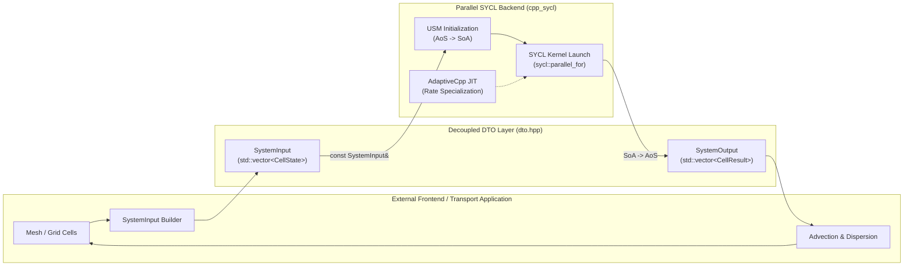
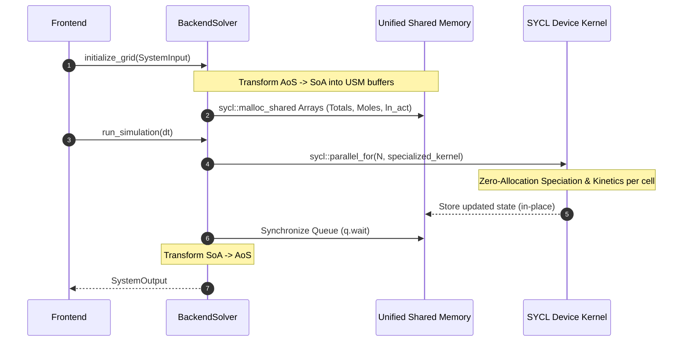

# Architecture & Interface Design

## 1. Overview and Core Philosophy

The primary design principle of this C++ / SYCL implementation is **strict functional decoupling** between the high-level application logic (frontend / transport solver / grid mesh) and the parallel compute engine (SYCL backend):

1. **Frontend Agnosticism**: The frontend has zero dependencies on SYCL, OpenMP, GPU drivers, or device hardware headers. It interacts exclusively using standard C++ types (STL vectors, maps, doubles, strings).
2. **Pluggable Architecture**: An external transport code (e.g., 1D/2D/3D advection-dispersion solver, FVM/FEM code, or a Python C-extension) can completely replace the frontend by merely populating a `SystemInput` object before each time step and consuming a `SystemOutput` object afterwards.
3. **Serial Data Transfer Objects (DTOs)**: All cross-boundary communication is encapsulated in straightforward, easily serializable Data Transfer Objects ([`include/dto.hpp`](file:///mnt/nfsshare/home/mluebke/phreeqc3/cpp_sycl/include/dto.hpp)).



---

## 2. Data Transfer Objects ([`include/dto.hpp`](file:///mnt/nfsshare/home/mluebke/phreeqc3/cpp_sycl/include/dto.hpp))

All DTOs are declared in `include/dto.hpp` and rely exclusively on standard C++ library headers (`<string>`, `<vector>`, `<unordered_map>`).

### 2.1 Input Data Structures

#### `MineralCompInput`
Defines the equilibrium phase state within a single cell prior to a time step:
```cpp
struct MineralCompInput {
    std::string name;            // Phase name (e.g., "Gypsum")
    double target_si = 0.0;      // Target saturation index (0.0 = equilibrium)
    double moles = 0.0;          // Available mineral mass (mol)
    bool force_equality = false; // true = strictly enforce SI (infinite mineral reservoir)
};
```

#### `KineticCompInput`
Defines a kinetic reaction component (e.g., mineral dissolution governed by a rate law):
```cpp
struct KineticCompInput {
    std::string rate_name;               // Registered rate name (e.g., "Calcite")
    double moles = 0.0;                  // Current mineral mass (mol)
    double moles_init = 0.0;             // Initial mineral mass (m0)
    std::vector<double> rate_parameters; // Specific parameters (e.g., parms[0] = A/V)
};
```

#### `CellState`
Represents the complete thermodynamic and chemical state of a single grid cell:
```cpp
struct CellState {
    int cell_id = 0;
    double temperature_c = 25.0; // Temperature in °C
    double pressure_atm = 1.0;   // Pressure in atm
    double water_mass_kg = 1.0;  // Mass of solvent water (kg)
    double initial_ph = 7.0;     // Initial pH
    double charge_balance_target = 0.0; // Charge imbalance target (mol eq)

    // Total elemental molalities: e.g. {"Ca+2": 0.001, "CO3-2": 0.002, "SO4-2": 0.003}
    std::unordered_map<std::string, double> element_totals;

    // Equilibrium mineral phases
    std::vector<MineralCompInput> minerals;

    // Kinetic reactions
    std::vector<KineticCompInput> kinetics;
};
```

#### `SystemInput`
Aggregates the entire spatial grid for a simulation time step:
```cpp
struct SystemInput {
    double dt = 0.0; // Step duration in seconds
    std::vector<std::string> element_names; // Ordered element names
    std::vector<std::string> mineral_names; // Ordered equilibrium phase names
    std::vector<std::string> kinetic_names; // Ordered kinetic rate names
    std::vector<CellState> cells;           // States for all grid cells (length N)
};
```

---

### 2.2 Output Data Structures

#### `CellResult`
Holds the output state of a single cell after completing the time step $\Delta t$:
```cpp
struct CellResult {
    int cell_id = 0;
    bool converged = true;     // Convergence status (true = Newton-Raphson converged)
    double final_ph = 7.0;     // Computed final pH
    double time_elapsed = 0.0; // Actual simulated time (s)

    // Updated total element concentrations (mol/kgw)
    std::unordered_map<std::string, double> element_totals;

    // Remaining equilibrium mineral mass (mol)
    std::unordered_map<std::string, double> mineral_moles;

    // Remaining kinetic mineral mass (mol)
    std::unordered_map<std::string, double> kinetic_moles;
};
```

#### `SystemOutput`
The primary return object emitted by the parallel backend:
```cpp
struct SystemOutput {
    std::vector<CellResult> cells; // Results across all cells
    double elapsed_seconds = 0.0;  // Wall-clock time measured on the backend
};
```

---

## 3. Dataflow & Memory Layout Transformation (AoS $\leftrightarrow$ SoA)

To achieve peak memory bandwidth on GPUs and SIMD vector units on multi-core CPUs, the backend transforms the object-oriented Array-of-Structures (AoS) representation (`std::vector<CellState>`) provided by the frontend into a cache-coherent **Structure-of-Arrays (SoA)** layout in Unified Shared Memory (USM).



### Transformation Details
- **Frontend**: `input.cells[cell_idx].element_totals["Ca+2"]`
- **Backend USM Layout**: `state_->element_totals[element_idx * N + cell_idx]`
  - Adjacent SYCL work-items (threads executing consecutive `cell_idx`) access contiguous memory addresses (**Coalesced Memory Access**).
- **Return**: After kernel completion, SoA arrays are packed back into the `SystemOutput` structure for the frontend.

---

## 4. Lifecycle Management

Backend resource allocation follows the RAII (Resource Acquisition Is Initialization) pattern:

1. **Construction (`BackendSolver`)**:
   - Initializes the SYCL queue (default device or explicit GPU/CPU device selector).
   - Allocates static device constant buffers (`dev_species_stoich_`, `dev_species_logK_`, etc.) in shared memory.
2. **Grid Initialization (`initialize_grid`)**:
   - Reallocates USM cell arrays (`ParallelSolverState`) if the number of cells $N$ changes.
   - Copies initial element concentrations, mineral inventories, and kinetic parameters.
3. **Two-Stage Initial Equilibration (`equilibrate_initial_state`)**:
   - Computes initial aqueous speciation at fixed pH (Stage 1) to determine background charge imbalance.
   - Equilibrates mineral phases at floating pH (Stage 2).
   - Warm-starts all grid cells with the converged master activities (`master_activities`), ensuring instantaneous convergence in subsequent time steps.
4. **Destruction**:
   - Deallocates all USM pointers via `sycl::free(ptr, queue)`. Guaranteed zero memory leaks.
