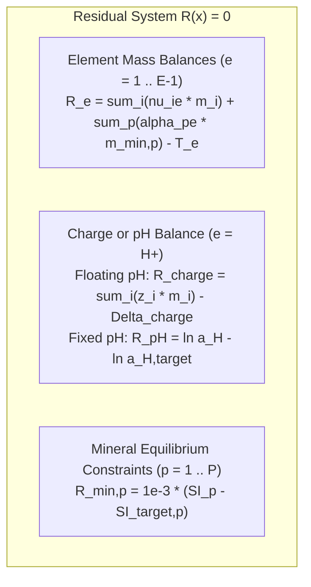
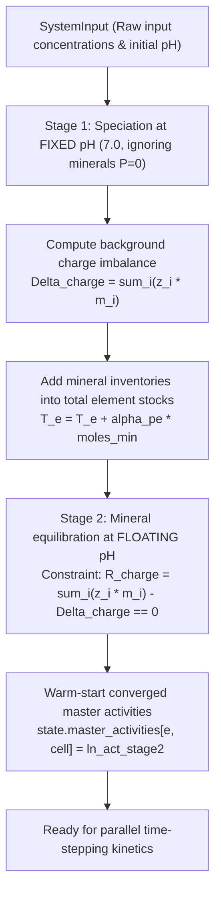
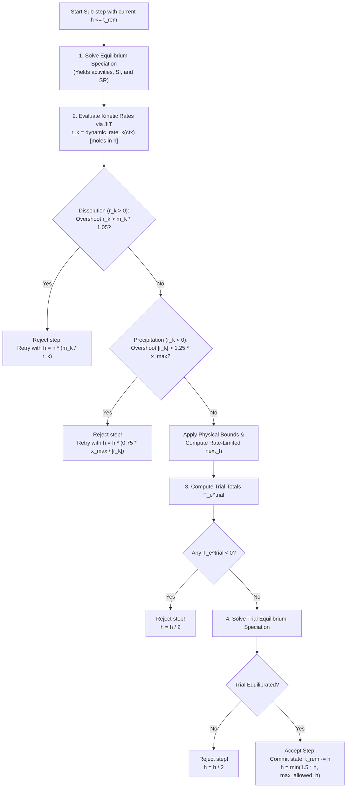

# Numerical Methods & Geochemical Formulation

## 1. Thermodynamic Fundamentals of Speciation

Geochemical equilibrium in aqueous systems is governed by the **Law of Mass Action** combined with fundamental conservation principles (mass and charge conservation).

### 1.1 Master and Secondary Species
The chemical system is spanned by $E$ master species (e.g., $\text{Ca}^{+2}$, $\text{CO}_3^{-2}$, $\text{SO}_4^{-2}$, $\text{H}^+$). Each secondary aqueous species $i \in \{1, \dots, S\}$ is formed via a reversible reaction involving master species:

$$\sum_{e=1}^E \nu_{ie} M_e \rightleftharpoons A_i$$

Applying the Law of Mass Action yields:

$$K_i = \frac{a_i}{\prod_{e=1}^E a_e^{\nu_{ie}}} \implies \ln m_i = \ln K_i + \sum_{e=1}^E \nu_{ie} \ln a_e - \ln \gamma_i$$

Where:
- $m_i$: Molality of secondary species $i$ (mol/kgw)
- $a_e$: Thermodynamic activity of master species $e$
- $\gamma_i$: Activity coefficient ($a_i = \gamma_i \cdot m_i$)
- $K_i$: Equilibrium formation constant

---

## 2. Activity Coefficient Modeling (Debye-Hückel)

Aqueous activity coefficients are evaluated using the extended Debye-Hückel (WATEQ / Truesdell-Jones) formulation ([`include/device_types.hpp`](file:///mnt/nfsshare/home/mluebke/phreeqc3/cpp_sycl/include/device_types.hpp)):

$$\log_{10} \gamma_i = -\frac{A \cdot z_i^2 \sqrt{I}}{1 + B \cdot a_i^0 \sqrt{I}} + b_i \cdot I$$

For uncharged species ($z_i = 0$), $\gamma_i = 1.0$ (or Setchénow relationship). Ionic strength $I$ is computed from all charged dissolved species:

$$I = \frac{1}{2} \sum_{i=1}^S z_i^2 \cdot m_i$$

Parameters at $25^\circ\text{C}$: $A \approx 0.5085$, $B \approx 0.3281 \times 10^8$.

---

## 3. Residual Equations & Equilibrium System

The non-linear algebraic system for a cell with $E$ elements and $P$ equilibrium minerals has dimension $E + P$:

### 3.1 Primary Unknowns $x$
- $\ln a_e$ for $e = 1, \dots, E$ (Natural logs of master activities)
- $m_{\text{min}, p}$ for $p = 1, \dots, P$ (Moles of equilibrium mineral phases)

### 3.2 Residual Formulations $R(x)$
1. **Element Mass Balance** ($e \ne \text{H}^+$):
   $$R_e = \sum_{i=1}^S \nu_{ie} m_i + \sum_{p=1}^P \alpha_{pe} m_{\text{min}, p} - T_e = 0$$
   ($T_e$: Prescribed total element molality, $\alpha_{pe}$: Stoichiometric coefficient of element $e$ in mineral $p$).
2. **Charge Balance at Floating pH** ($e = \text{H}^+$):
   $$R_{\text{charge}} = \sum_{i=1}^S z_i m_i - \Delta_{\text{charge}} = 0$$
   ($\Delta_{\text{charge}}$: Target charge imbalance determined during initial equilibration).
3. **Fixed pH Mode** (e.g. Stage 1 speciation):
   $$R_{\text{pH}} = \ln a_{\text{H}^+} - \ln a_{\text{target}} = 0$$
4. **Mineral Equilibrium Constraints**:
   $$SI_p = \log_{10} IAP_p - \log_{10} K_{sp, p} = \sum_{e=1}^E \alpha_{pe} \frac{\ln a_e}{\ln 10} - \log_{10} K_{sp, p}$$
   - If $m_{\text{min}, p} > 0$ or `force_equality == true`:
     $$R_{E + p} = 10^{-3} \cdot (SI_p - SI_{\text{target}, p}) = 0$$
   - If undersaturated and mineral is exhausted: Row is deactivated ($R_{E+p} = 0, \Delta m_{\text{min}, p} = 0$).

---

## 4. Analytical Jacobian Formulation

The Jacobian matrix $J \in \mathbb{R}^{(E+P) \times (E+P)}$ with entries $J_{jk} = \frac{\partial R_j}{\partial x_k}$ is constructed analytically directly in thread registers:

1. **Element-Activity Block** ($j \in [0, E-1], k \in [0, E-1]$):
   $$\frac{\partial R_j}{\partial \ln a_k} = \sum_{i=1}^S \nu_{ji} \nu_{ki} m_i$$
2. **Charge Balance Row** ($j = \text{H}^+, k \in [0, E-1]$):
   $$\frac{\partial R_{\text{charge}}}{\partial \ln a_k} = \sum_{i=1}^S z_i \nu_{ki} m_i$$
3. **Element-Mineral Coupling** ($j \in [0, E-1], p \in [0, P-1]$):
   $$\frac{\partial R_j}{\partial m_{\text{min}, p}} = \alpha_{pj}$$
4. **Mineral-Activity Block** ($p \in [0, P-1], k \in [0, E-1]$):
   $$\frac{\partial R_{E+p}}{\partial \ln a_k} = 10^{-3} \cdot \frac{\alpha_{pk}}{\ln 10}$$

The linear system $J \cdot \Delta x = -R$ is inverted using partial pivoting.

### 4.1 Zero-Mass Element Handling (`has_mass[e]`)
In multi-dimensional reactive transport simulations, certain elements may be entirely absent in specific cells (e.g., pristine groundwater before tracer/mineral fronts arrive, such as $\text{Cl}^- = 0$ or $\text{Mg}^{+2} = 0$). Standard Newton-Raphson solvers construct zero rows and columns in the Jacobian when $T_e = 0$ and $m_{\text{min}, p} = 0$, leading to singular matrices and divergence.

To prevent singularity, the solver dynamically tracks element availability:
- An element $e$ has mass (`has_mass[e] == true`) if $e = \text{H}^+$, or $T_e > 10^{-16}$, or any present/forced mineral contains $e$.
- If `has_mass[e] == false`:
  - Its master activity is pinned to $\ln a_e = -40 \ln 10$.
  - Secondary species containing element $e$ are assigned zero molality ($m_i = 0$).
  - Its residual is set to zero ($R_e = 0$).
  - The Jacobian is decoupled by setting the diagonal entry $J_{ee} = 1.0$ and off-diagonals $J_{ek} = J_{ke} = 0.0$.
  - Update steps $\Delta \ln a_e$ are skipped.

This ensures the linear system remains strictly non-singular and well-conditioned without requiring dynamic reallocation or cell-by-cell matrix reconfiguration.

### 4.2 Step Relaxation & Convergence
To prevent divergence due to exponential terms, update steps are clamped:
$$\Delta \ln a_e = \text{clamp}(\Delta \ln a_e, -2.302, +2.302)$$
This bounds activity changes to at most one order of magnitude per Newton iteration.

Convergence criterion: $\|R\|_2 < 10^{-11}$.

---

## 5. Two-Stage Initial Equilibration Workflow

In realistic geochemical modeling scenarios, water analyses (e.g., pH = 7.0, $\text{Ca} = 1\,\text{mM}$, $\text{CO}_3 = 2\,\text{mM}$, $\text{SO}_4 = 3\,\text{mM}$) rarely satisfy electrical neutrality perfectly. PHREEQC accommodates this by establishing a permanent background charge imbalance during initialization.

The C++ backend reproduces this via a robust two-stage process ([`src/parser.cpp`](file:///mnt/nfsshare/home/mluebke/poet-MP/ext/litephreeqc-MP/src/parser.cpp)):

By **warm-starting** all grid cells with the converged activities from Stage 2, subsequent kinetic time steps typically converge in fewer than 3 Newton-Raphson iterations.

---

## 6. Rate-Limited Adaptive Time Sub-stepping for Kinetics

Coupled reactive transport requires robust, accurate integration of kinetic mineral reactions over outer time steps $\Delta t$. Because mineral dissolution and precipitation rates non-linearly depend on saturation indices ($SR$), unconstrained explicit integration can overshoot equilibrium, deplete minerals prematurely, or cause unphysical oscillations.

To eliminate truncation errors while preserving maximum hardware throughput, `solver_backend.cpp` implements a **physical rate-limited adaptive sub-stepping integrator**:

### 6.1 Sub-step Execution Cycle

### 6.2 Dissolution Boundary Controls
1. **Trace Depletion**: If mineral inventory $m_k \le 10^{-12}\,\text{mol}$, rate is clamped to zero ($r_k = 0$).
2. **Depletion Overshoot Rejection**: For $m_k > 10^{-8}\,\text{mol}$, if $r_k > m_k \times 1.05$, explicit Euler would prematurely deplete the mineral. The step is rejected and retried with the exact physical exhaustion time step:
   $$h_{\text{exact}} = h \cdot \frac{m_k}{r_k}$$
   For trace amounts ($m_k \le 10^{-8}\,\text{mol}$), $r_k$ is clamped to $m_k$ without rejection, completely preventing Zeno-paradox stalls.
3. **Rate-Limited Dissolution Growth**: Sub-step growth is bounded so that at most $20\,\%$ of the remaining mineral dissolves in a single step:
   $$h_{\text{limit, diss}} = h \cdot \frac{0.20 \cdot m_k + 10^{-7}}{r_k}$$

### 6.3 Precipitation Saturation Capacity Controls
1. **Precipitation Capacity Calculation**: For supersaturated phases ($SR > 1.0$), the maximum mineral precipitation before equilibrium ($SR = 1.0$) is estimated from aqueous element totals:
   $$x_{\max} = \min_{e \ne \text{H}^+, \nu_{ke} > 0} \left( \frac{T_e}{\nu_{ke}} \cdot \left( 1 - \frac{1}{SR} \right) \right)$$
2. **Equilibrium Overshoot Rejection**: If $|r_k| > 1.25 \cdot x_{\max}$ (with $x_{\max} > 10^{-8}$), explicit Euler would violently overshoot saturation into undersaturation. The step is rejected and retried with:
   $$h_{\text{retry}} = h \cdot \frac{0.75 \cdot x_{\max}}{|r_k|}$$
3. **Soft Damping**: If $|r_k| > x_{\max}$, soft saturation damping prevents discrete overshoot:
   $$|r_k| \leftarrow x_{\max} \cdot \left( 1 - \exp\left(-\frac{|r_k|}{x_{\max}}\right) \right)$$
4. **Rate-Limited Precipitation Growth**: Sub-step growth is bounded to at most $25\,\%$ of the equilibrium capacity:
   $$h_{\text{limit, prec}} = h \cdot \frac{0.25 \cdot x_{\max} + 10^{-7}}{|r_k|}$$

### 6.4 Reactive Front Step Capping vs. Quiescent Expansion
- **Actively Reacting Cells** ($|r_k| > 10^{-8}\,\text{mol}$): The maximum allowed sub-step is capped at $h \le 5.0\,\text{s}$ to prevent accumulated explicit Euler integration drift.
- **Quiescent & Equilibrium Cells** ($|r_k| \le 10^{-8}\,\text{mol}$): `max_allowed_h` remains $10^{30}$, allowing sub-steps to double/grow at $1.5\times$ up to the full time step $\Delta t = 200\,\text{s}$ in just 12 steps.

This rate-limiting ensures that $>99\,\%$ of grid cells execute at peak speed while actively reacting reaction-front cells maintain sub-nanomole numerical fidelity.
