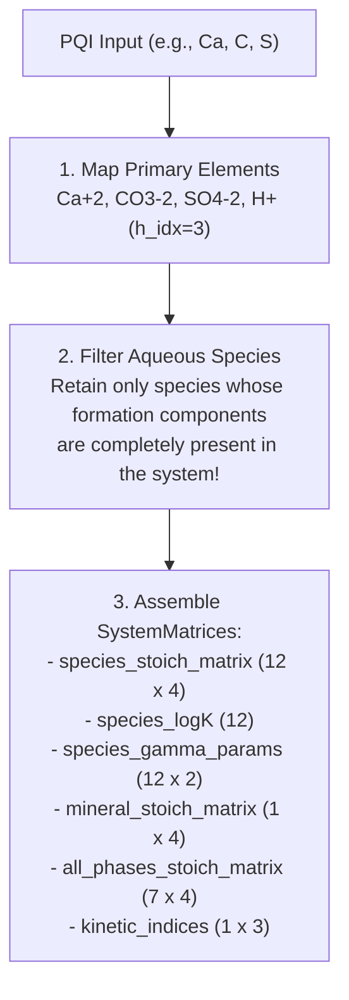

# Parser & Database Subsystem

## 1. Overview

The `cpp_sycl` codebase includes standalone C++ parsers ([`include/parser.hpp`](file:///mnt/nfsshare/home/mluebke/phreeqc3/cpp_sycl/include/parser.hpp) and [`src/parser.cpp`](file:///mnt/nfsshare/home/mluebke/phreeqc3/cpp_sycl/src/parser.cpp)) designed to operate with zero external dependencies (no Boost, no Python runtime, and no legacy PHREEQC C code).

The subsystem accomplishes three tasks:
1. **Parses the thermodynamic database** (`phreeqc_kin.dat`).
2. **Parses the simulation input script** (`verify.pqi`).
3. **Assembles stoichiometric matrices and system vectors** for the parallel SYCL device kernel.

---

## 2. Database Parser (`PhreeqcDatabase`)

The database parser reads standard PHREEQC `.dat` files line-by-line, stripping inline comments and extracting the following sections:

### 2.1 Supported Sections
- `SOLUTION_MASTER_SPECIES`: Declares primary master species (e.g., `Ca  Ca+2  0.0  Ca  40.08`).
- `SOLUTION_SPECIES`: Declares secondary aqueous species, equilibrium formation constants $\log_{10} K$, and Debye-Hückel parameters ($a_0, b_0$).
- `PHASES`: Declares solid mineral and gas phases, their dissolution reactions, and solubility products.
- `RATES`: Declares kinetic rate blocks.

### 2.2 Species Identification & Formation Reactions

Accurately interpreting formation reactions from standard PHREEQC databases requires robust handling of equation structure:

In `SOLUTION_SPECIES`, typical simple reactions appear as:
```
HCO3- = CO3-2 + H+
log_k -10.329
```
However, complexation reactions also appear in the form:
```
Pb+2 + HCO3- = PbHCO3+
log_k 1.48
```
A naive parser that assumes the defined species is always on the right or left of `=` would accidentally overwrite primary species or fail to identify the target product.

**Implemented Logic (`determine_defined_species`)**:
1. Separates reactants (left of `=`) from products (right of `=`).
2. Normalizes the equation so the species being defined has a stoichiometric coefficient of $+1.0$ on the left-hand side.
3. Validates that all remaining participants in the decomposition consist of known master species before registering the formation reaction.

### 2.3 Charge Preservation in Formula Splitting
When splitting formulas and reactions, the parser explicitly splits on whitespace-padded operators (`" + "`). Splitting on bare `+` would corrupt ionic charges such as `Ca+2`.

---

## 3. PQI Script Parser (`PqiParser`)

The PQI parser processes PHREEQC scenario definitions:

```
SOLUTION 1
    temp 25
    pH 7.0
    units mol/kgw
    Ca 0.001
    C 0.002
    S 0.003
EQUILIBRIUM_PHASES 1
    Gypsum 0.0 0.0
KINETICS 1
Calcite
    -m0 0.01
    -m 0.01
    -parms 100.0
    -steps 100.0
END
```

The parser extracts:
- Temperature $T$, initial pH, and elemental total inventories (`Ca`, `C`, `S`).
- Equilibrium phases with target saturation indices (`Gypsum`: target SI = 0.0, initial mass = 0.0).
- Kinetic components (`Calcite`: initial mass $m_0 = 0.01$, current mass $m = 0.01$, surface area parameter $A/V = 100\,\text{dm}^{-1}$, step duration $\Delta t = 100\,\text{s}$).

---

## 4. Matrix Assembly (`SystemBuilder::build_system_matrices`)

The `SystemBuilder` combines database records with script specifications to construct dense stoichiometric matrices for the device kernel:



### 4.1 Filtering Redox Species in Non-Redox Systems
In systems without active redox reactions (such as `verify.pqi`), the electron `e-` is not an active master element.

In `src/parser.cpp`, aqueous species are filtered as follows:
```cpp
// Filter aqueous species
for (const auto& pair : db.species) {
    const auto& spec = pair.second;
    bool valid = true;
    for (const auto& r : spec.reaction) {
        if (r.first == "H2O") continue; // Solvent water is ignored
        if (elt_to_idx.find(r.first) == elt_to_idx.end()) {
            valid = false; // Element not present in active system -> exclude species!
            break;
        }
    }
    if (valid) sm.species_names.push_back(spec.name);
}
```
**Critical Note**: If `r.first == "e-"` were ignored, unbalanced redox species (such as free aqueous electrons or $H_2$) would enter speciation, leading to divergent Newton-Raphson iterations and invalid charge balances.

### 4.2 Filtering Relevant Phases (`all_phases_stoich_matrix`)
A standard database contains hundreds of solid phases (feldspars, oxides, heavy metal precipitates). The builder filters `all_phase_names` to include only those whose stoichiometric components form a true subset of the active system elements. This guarantees that `P_all` remains small ($< 10$), comfortably fitting within GPU register bounds.
