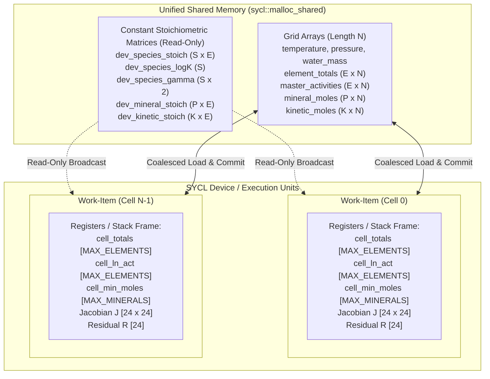

# SYCL Kernel & Memory Model

## 1. Zero-Allocation Device Kernel

On massively parallel execution hardware (such as GPUs or high-throughput CPU vector pipelines), dynamic heap allocations (`malloc`, `new`, `std::vector::resize`) inside a device kernel incur critical performance penalties:
- Severe lock contention on the device runtime heap manager.
- Fragmentation of device memory pools.
- Compiler incompatibilities (many GPU code generation targets completely prohibit dynamic device allocation or trigger expensive exception traps).

**Core Design Decision**: The SYCL kernel in `cpp_sycl` enforces **0 dynamic heap allocations** per cell during execution. All intermediate variables, vectors, residual buffers, and the Jacobian matrix required for the Newton-Raphson solver are allocated entirely within **thread-private registers or the private stack frame**.

---

## 2. Statically Bounded Data Structures ([`include/device_types.hpp`](file:///mnt/nfsshare/home/mluebke/phreeqc3/cpp_sycl/include/device_types.hpp))

To handle variable chemical systems without resorting to dynamic heap allocation, generic templates with compile-time upper bounds are employed:

### 2.1 Dimensional Upper Bounds
```cpp
namespace geochem {
    constexpr int MAX_ELEMENTS    = 16;  // Maximum primary elements in chemical system
    constexpr int MAX_SPECIES     = 64;  // Maximum secondary aqueous species
    constexpr int MAX_MINERALS    = 8;   // Maximum coexisting equilibrium phases
    constexpr int MAX_ALL_PHASES  = 64;  // Maximum phases considered for SI/SR evaluation
    constexpr int MAX_KINETICS    = 8;   // Maximum concurrent kinetic reactions
    constexpr int MAX_RATE_PARAMS = 8;   // Maximum rate parameters per kinetic law
    constexpr int MAX_SYS_DIM     = MAX_ELEMENTS + MAX_MINERALS; // 24x24 Jacobian dimension
}
```

### 2.2 `FixedVector` and `FixedMatrix`
These templates wrap fixed-size arrays residing on the private stack:
```cpp
template <typename T, int Dim>
struct FixedVector {
    T data[Dim] = {0};

    inline T& operator[](int i) { return data[i]; }
    inline const T& operator[](int i) const { return data[i]; }
    inline void fill(T val) { for (int i = 0; i < Dim; ++i) data[i] = val; }
};

template <typename T, int Rows, int Cols>
struct FixedMatrix {
    T data[Rows * Cols] = {0};

    inline T& operator()(int r, int c) { return data[r * Cols + c]; }
    inline const T& operator()(int r, int c) const { return data[r * Cols + c]; }
    inline void fill(T val) { for (int i = 0; i < Rows * Cols; ++i) data[i] = val; }
};
```

---

## 3. Thread-Local Gaussian Elimination with Partial Pivoting

Solving the linear system $J \cdot \Delta x = -R$ inside every Newton-Raphson iteration is performed entirely in registers without external LAPACK/BLAS dependencies via `solve_linear_system_device`:

```cpp
template <int MaxDim>
inline bool solve_linear_system_device(int n, FixedMatrix<double, MaxDim, MaxDim>& A,
                                       FixedVector<double, MaxDim>& b,
                                       FixedVector<double, MaxDim>& x) {
    // 1. Forward elimination with row pivoting
    for (int i = 0; i < n; ++i) {
        int max_row = i;
        double max_val = sycl::fabs(A(i, i));
        for (int r = i + 1; r < n; ++r) {
            double v = sycl::fabs(A(r, i));
            if (v > max_val) {
                max_val = v;
                max_row = r;
            }
        }

        // Swap rows
        if (max_row != i) {
            for (int c = i; c < n; ++c) {
                double tmp = A(i, c);
                A(i, c) = A(max_row, c);
                A(max_row, c) = tmp;
            }
            double tmp = b[i];
            b[i] = b[max_row];
            b[max_row] = tmp;
        }

        double pivot = A(i, i);
        if (sycl::fabs(pivot) < 1e-18) return false; // Singular matrix

        // Elimination
        for (int r = i + 1; r < n; ++r) {
            double factor = A(r, i) / pivot;
            for (int c = i; c < n; ++c) {
                A(r, c) -= factor * A(i, c);
            }
            b[r] -= factor * b[i];
        }
    }

    // 2. Back substitution
    for (int i = n - 1; i >= 0; --i) {
        double s = 0.0;
        for (int c = i + 1; c < n; ++c) {
            s += A(i, c) * x[c];
        }
        x[i] = (b[i] - s) / A(i, i);
    }
    return true;
}
```

Partial row pivoting ensures numerical stability even when variables span widely different orders of magnitude (e.g., $H^+$ activity $\approx 10^{-7}$ vs. $\text{SO}_4^{-2} \approx 10^{-3}$).

---

## 4. Memory Hierarchy & Unified Shared Memory (USM)

The memory architecture is structured into two primary tiers:



### 4.1 USM Allocation (`sycl::malloc_shared`)
- **Seamless Unified Access**: Data buffers can be directly addressed by both the host CPU (for parsing and result marshalling) and the device kernels without manual `memcpy` calls.
- **Hardware Portability**: Runs transparently on discrete NVIDIA/AMD GPUs (via page migration or zero-copy access) as well as CPU host execution units (via OpenMP).

### 4.2 Data Locality and Kernel Isolation
- Each SYCL work-item has an exact 1:1 mapping: `int idx = item[0];`
- Cells solve their chemical equilibrium and kinetic sub-steps **completely independently** (Embarrassingly Parallel).
- Zero inter-cell synchronization, zero race conditions, and zero barriers inside the parallel kernel.
