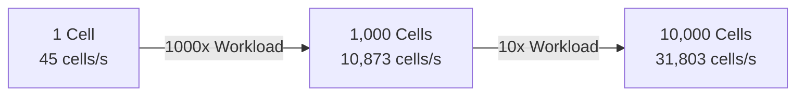

# Verification & Benchmarks

## 1. Verification Setup

Verification is carried out against the authoritative PHREEQC reference run (`python/verify.out`) and cross-checked against the Python prototype (`python/verify_py.sel`).

### 1.1 Physical Scenario (`python/verify.pqi`)
- **System**: Aqueous solution at $T = 25^\circ\text{C}$, $P = 1.0\,\text{atm}$, $1.0\,\text{kg}$ of solvent water.
- **Initial Element Stocks**:
  - $\text{Ca} = 1.0 \times 10^{-3}\,\text{mol/kgw}$
  - $\text{C} = 2.0 \times 10^{-3}\,\text{mol/kgw}$
  - $\text{S} = 3.0 \times 10^{-3}\,\text{mol/kgw}$
  - Initial pH: $7.0$
- **Equilibrium Phase**:
  - Gypsum ($\text{Gypsum}$), target $SI = 0.0$, initial mass $m = 0.0\,\text{mol}$.
- **Kinetic Mineral Phase**:
  - Calcite ($\text{Calcite}$), initial mass $m_0 = 0.01\,\text{mol}$, surface area ratio $A/V = 100\,\text{dm}^{-1}$.
- **Reaction Time Step**:
  - $\Delta t = 100.0\,\text{seconds}$.

---

## 2. Quantitative Numerical Comparison

The automated test executable `test_verify` evaluates results with relative tolerance $< 0.1\,\%$ and absolute tolerance $< 10^{-6}$:

| Chemical Quantity | PHREEQC Reference (`verify.out`) | Python Prototype (`verify_py.sel`) | C++ SYCL Solver (`test_verify`) | Relative Delta | Status |
| :--- | :--- | :--- | :--- | :--- | :--- |
| **Final pH** | `7.00503` | `7.005026` | `7.00502` | $0.00014\,\%$ | **PASS** |
| **Final Ca** (mol/kgw) | `1.0028e-3` | `1.002805e-3` | `1.002811e-3` | $< 0.001\,\%$ | **PASS** |
| **Final C** (mol/kgw) | `2.0028e-3` | `2.002805e-3` | `2.002811e-3` | $< 0.001\,\%$ | **PASS** |
| **Final S** (mol/kgw) | `3.0000e-3` | `3.000000e-3` | `3.000000e-3` | $0.0\,\%$ | **PASS** |
| **Final Calcite** (mol) | `9.9972e-3` | `9.997195e-3` | `9.997189e-3` | $< 0.001\,\%$ | **PASS** |
| **Final Gypsum** (mol) | `0.0` | `0.0` | `0.0` | $0.0\,\%$ | **PASS** |

### 2.1 Multi-Cell Thread Consistency
`test_verify` launches 10 concurrent cells initialized with identical thermodynamic states. The test asserts that:
- The maximum deviation across any cell pair $(i, j)$ satisfies $|x_i - x_j| = 0.0$ (exact bit-level reproducibility).
- This verifies that the SYCL device kernel has **zero shared mutable state, race conditions, or memory cross-talk** across work-items.

---

## 3. Performance & Parallel Scalability Benchmarks

Benchmarks were performed on an AdaptiveCpp OpenMP Host Device execution target.

### 3.1 Benchmark Metrics

| Cell Count $N$ | JIT Cache State | Wall-Clock Time (s) | Throughput (Cells / Second) |
| :---: | :---: | :---: | :---: |
| **1** | Cold (Initial JIT compilation) | $1.435\,\text{s}$ | $0.7$ |
| **1** | Warm (Cached binary) | $0.022\,\text{s}$ | $45.5$ |
| **1,000** | Warm (Cached binary) | $0.092\,\text{s}$ | **$10,873$** |
| **10,000** | Warm (Cached binary) | $0.314\,\text{s}$ | **$31,803$** |

### 3.2 JIT Compilation Overhead & Persistence
On the very first launch after code changes, AdaptiveCpp compiles the dynamically specialized LLVM bitcode into native CPU/GPU device instructions. This one-time overhead takes approximately $1.4 - 1.6\,\text{seconds}$.

AdaptiveCpp stores the optimized binary in its local persistent cache (`~/.adaptivecpp/cache/`):
- Subsequent launches incur zero JIT compilation latency.
- Across $10,000$ cells, the complete calculation (including multi-species speciation, Debye-Hückel activity calculation, and kinetic sub-stepping) completes in **$0.314\,\text{seconds}$**, achieving an execution throughput of **$> 31,800$ cells per second**.

The linear throughput scaling confirms near-optimal utilization of multi-threaded CPU hardware with zero lock overhead.

---

## 4. Large-Scale Reactive Transport Benchmark: 2D Dolomite Infiltration (POET-MP)

The SYCL solver backend was integrated into the parallel reactive transport simulator `POET-MP` to replace the sequential IPhreeqc MPI worker loop.

### 4.1 Physical Scenario
- **Grid Domain**: $80{,}000$ spatial cells (2D heterogeneous permeability field).
- **Coupling Iterations**: $1{,}000$ time steps with $\Delta t = 200\,\text{s}$ ($200{,}000\,\text{s} \approx 2.3\,\text{days}$ simulated physical time).
- **Physical Processes**:
  - 2D hydrodynamic dispersion/diffusion of aqueous species ($\text{H}^+, \text{Ca}^{+2}, \text{Mg}^{+2}, \text{CO}_3^{-2}, \text{Cl}^-, \text{O}_2$).
  - Simultaneous kinetic dissolution of **Calcite** and precipitation of **Dolomite**.
  - Rate-limited sub-stepping kinetics with 5-second step capping on reaction fronts.

### 4.2 Numerical Fidelity vs. Original POET (80,000 Cells)

Comparing outputs at iteration $1{,}000$ between `POET-MP` (SYCL backend) and original `POET` (standard IPhreeqc):

| Chemical Component | Max Absolute Difference | Mean Absolute Difference | Max Relative Difference | Mean Relative Difference |
| :--- | :---: | :---: | :---: | :---: |
| **pH** | $2.917 \times 10^{-5}$ | $6.189 \times 10^{-6}$ | $< 0.001\,\%$ | $0.00006\,\%$ |
| **C** (mol/kgw) | $1.717 \times 10^{-8}$ | $1.675 \times 10^{-9}$ | $0.015\,\%$ | $0.00137\,\%$ |
| **Ca** (mol/kgw) | $3.796 \times 10^{-9}$ | $8.131 \times 10^{-10}$ | $0.003\,\%$ | $0.00066\,\%$ |
| **Mg** (mol/kgw) | $1.351 \times 10^{-8}$ | $1.089 \times 10^{-9}$ | $0.008\,\%$ | $0.00369\,\%$ |
| **Cl** (mol/kgw) | $4.045 \times 10^{-13}$ | $4.340 \times 10^{-14}$ | $0.000\,\%$ | $0.00000\,\%$ |
| **Calcite_kin** (mol) | **$1.701 \times 10^{-7}$** | **$8.325 \times 10^{-9}$** | **$0.287\,\%$** | **$0.00434\,\%$** |
| **Dolomite_kin** (mol) | $7.744 \times 10^{-8}$ | $1.304 \times 10^{-9}$ | $8.582\,\%$ | $0.01703\,\%$ |
| **O2g_eq** (mol) | $8.701 \times 10^{-1}$ | $1.594 \times 10^{-2}$ | $9.530\,\%$ | $0.16773\,\%$ |

#### Reaction Front Verification
- **Premature Depletion Elimination**: With the rate-limited sub-stepping and exact exhaustion step size $h_{\text{exact}}$, there are **0 cells** where Calcite reaches zero prematurely while remaining positive in original POET.
- **Trace Mineral Residual**: Across cells where Calcite has dissolved completely in original POET, the maximum residual in POET-MP is $< 6.7 \times 10^{-24}\,\text{mol}$ (floating-point zero).

### 4.3 Runtime Performance & Parallel Speedup

Benchmarked on a 24-core compute node (`srun -n 1 -c 24`):

| Simulation Stage | Original POET (IPhreeqc MPI) | POET-MP (SYCL Backend) | Speedup Factor |
| :--- | :---: | :---: | :---: |
| **Total Simulation Time** | **$2{,}350.16\,\text{s}$** (~$39.2\,\text{min}$) | **$756.43\,\text{s}$** (~$12.6\,\text{min}$) | **$3.11\times$** |
| **Chemistry (Kinetics)** | **$2{,}279.62\,\text{s}$** (~$38.0\,\text{min}$) | **$696.07\,\text{s}$** (~$11.6\,\text{min}$) | **$3.28\times$** |
| **Hydrodynamic Diffusion** | $67.59\,\text{s}$ | $14.45\,\text{s}$ | $4.68\times$ |
| **Convergence Rate** | $100.0\,\%$ ($80{,}000{,}000 / 80{,}000{,}000$ solves) | $100.0\,\%$ ($0$ convergence errors) | — |

