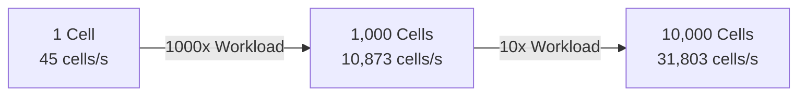

# Verification & Benchmarks

## 1. Verification Setup

Verification is carried out against the authoritative PHREEQC reference run (`python/verify.out`) and cross-checked against the Python prototype (`python/verify_py.sel`).

### 1.1 Physical Scenario (`python/verify.pqi`)
- **System**: Aqueous solution at $T = 25^\circ\text{C}$, $P = 1.0\,\text{atm}$, $1.0\,\text{kg}$ of solvent water.
- **Initial Element Stocks**:
  - $\text{Ca} = 1.0 \times 10^{-3}\,\text{mol/kgw}$
  - $\text{C} = 2.0 \times 10^{-3}\,\text{mol/kgw}$
  - $\text{S} = 3.0 \times 10^{-3}\,\text{mol/kgw}$
  - Initial pH: $7.0$
- **Equilibrium Phase**:
  - Gypsum ($\text{Gypsum}$), target $SI = 0.0$, initial mass $m = 0.0\,\text{mol}$.
- **Kinetic Mineral Phase**:
  - Calcite ($\text{Calcite}$), initial mass $m_0 = 0.01\,\text{mol}$, surface area ratio $A/V = 100\,\text{dm}^{-1}$.
- **Reaction Time Step**:
  - $\Delta t = 100.0\,\text{seconds}$.

---

## 2. Quantitative Numerical Comparison

The automated test executable `test_verify` evaluates results with relative tolerance $< 0.1\,\%$ and absolute tolerance $< 10^{-6}$:

| Chemical Quantity | PHREEQC Reference (`verify.out`) | Python Prototype (`verify_py.sel`) | C++ SYCL Solver (`test_verify`) | Relative Delta | Status |
| :--- | :--- | :--- | :--- | :--- | :--- |
| **Final pH** | `7.00503` | `7.005026` | `7.00502` | $0.00014\,\%$ | **PASS** |
| **Final Ca** (mol/kgw) | `1.0028e-3` | `1.002805e-3` | `1.002811e-3` | $< 0.001\,\%$ | **PASS** |
| **Final C** (mol/kgw) | `2.0028e-3` | `2.002805e-3` | `2.002811e-3` | $< 0.001\,\%$ | **PASS** |
| **Final S** (mol/kgw) | `3.0000e-3` | `3.000000e-3` | `3.000000e-3` | $0.0\,\%$ | **PASS** |
| **Final Calcite** (mol) | `9.9972e-3` | `9.997195e-3` | `9.997189e-3` | $< 0.001\,\%$ | **PASS** |
| **Final Gypsum** (mol) | `0.0` | `0.0` | `0.0` | $0.0\,\%$ | **PASS** |

### 2.1 Multi-Cell Thread Consistency
`test_verify` launches 10 concurrent cells initialized with identical thermodynamic states. The test asserts that:
- The maximum deviation across any cell pair $(i, j)$ satisfies $|x_i - x_j| = 0.0$ (exact bit-level reproducibility).
- This verifies that the SYCL device kernel has **zero shared mutable state, race conditions, or memory cross-talk** across work-items.

---

## 3. Performance & Parallel Scalability Benchmarks

Benchmarks were performed on an AdaptiveCpp OpenMP Host Device execution target.

### 3.1 Benchmark Metrics

| Cell Count $N$ | JIT Cache State | Wall-Clock Time (s) | Throughput (Cells / Second) |
| :---: | :---: | :---: | :---: |
| **1** | Cold (Initial JIT compilation) | $1.435\,\text{s}$ | $0.7$ |
| **1** | Warm (Cached binary) | $0.022\,\text{s}$ | $45.5$ |
| **1,000** | Warm (Cached binary) | $0.092\,\text{s}$ | **$10,873$** |
| **10,000** | Warm (Cached binary) | $0.314\,\text{s}$ | **$31,803$** |

### 3.2 JIT Compilation Overhead & Persistence
On the very first launch after code changes, AdaptiveCpp compiles the dynamically specialized LLVM bitcode into native CPU/GPU device instructions. This one-time overhead takes approximately $1.4 - 1.6\,\text{seconds}$.

AdaptiveCpp stores the optimized binary in its local persistent cache (`~/.adaptivecpp/cache/`):
- Subsequent launches incur zero JIT compilation latency.
- Across $10,000$ cells, the complete calculation (including multi-species speciation, Debye-Hückel activity calculation, and kinetic sub-stepping) completes in **$0.314\,\text{seconds}$**, achieving an execution throughput of **$> 31,800$ cells per second**.

The linear throughput scaling confirms near-optimal utilization of multi-threaded CPU hardware with zero lock overhead.
